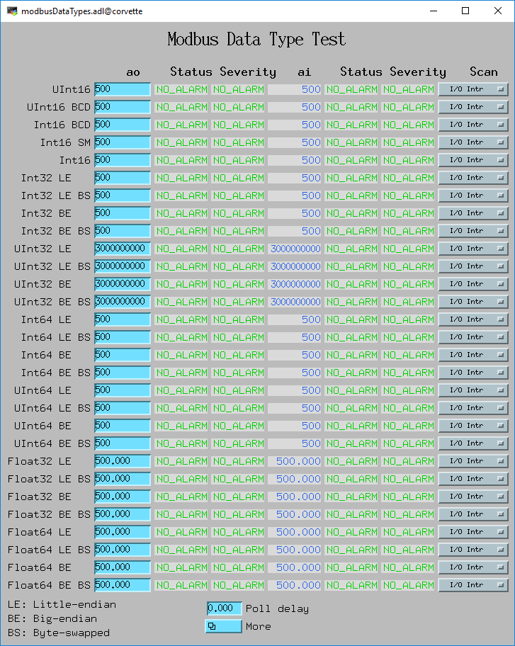
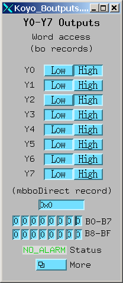
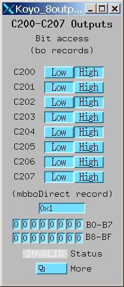
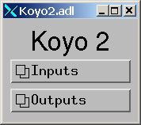

======
modbus
======

:author: Mark Rivers, University of Chicago

.. contents:: Contents

Acknowledgments
---------------

The **modbus** package is based on the `modtcp and plctcp
packages <http://isacwserv.triumf.ca/epics/modtcp/TRIUMFmodtcp.html>`__
written by Rolf Keitel from Triumf. The **modtcp** package was
originally converted to Linux by Ivan So from NSLS. **modbus** was
extensively re-written for conversion to EPICS 3.14 and to use the EPICS
asyn module. It now contains little of the original **modtcp** code, but
retains much of the original architecture.

Overview of Modbus
------------------

MODBUS is an application layer messaging protocol, positioned at level 7
of the OSI model, that provides client/server communication between
devices connected on different types of buses or networks. It is
typically used for communication with I/O systems, including
Programmable Logic Controllers (PLCs).

Modbus communication links
~~~~~~~~~~~~~~~~~~~~~~~~~~

Modbus supports the following 3 communication-link layers:

.. cssclass:: table-bordered table-striped table-hover
.. list-table::
   :header-rows: 1
   :widths: auto

   * - Link type
     - Description
   * - TCP
     - TCP/IP using standard port 502.
   * - RTU
     - RTU is normally run over serial communication links, i.e. RS-232,
       RS-422, or RS-485. RTU uses an additional CRC for packet checking. The
       protocol directly transmits each byte as 8 data bits, so uses "binary"
       rather than ASCII encoding. When using serial links start and end of
       message frames is detected by timing rather than by specific characters.
       RTU can also be run over TCP, though this is less common than the
       standard Modbus TCP without RTU.
   * - Serial ASCII
     - Serial protocol, which is normally run over serial communication links,
       i.e. RS-232, RS-422, or RS-485. Serial ASCII uses an additional LRC for
       packet checking. The protocol encodes each byte as 2 ASCII characters.
       The start and end of message frames is detected by specific characters
       (":" to start a message and CR/LF to end a message). This protocol is
       less efficient than RTU, but may be more reliable in some environments.
       ASCII can also be run over TCP, though this is much less common than the
       standard Modbus TCP.

This **modbus** package supports all of the above Modbus
communication-link layers.

Modbus data types
~~~~~~~~~~~~~~~~~

Modbus provides access to the following 4 types of data:

.. cssclass:: table-bordered table-striped table-hover
.. list-table::
   :header-rows: 1
   :widths: auto

   * - Primary tables
     - Object type
     - Access
     - Comments
   * - Discrete Inputs
     - Single bit
     - Read-Only
     - This type of data can be provided by an I/O system.
   * - Coils
     - Single bit
     - Read-Write
     - This type of data can be alterable by an application program.
   * - Input Registers
     - 16-bit word
     - Read-Only
     - This type of data can be provided by an I/O system.
   * - Holding Registers
     - 16-bit word
     - Read-Write
     - This type of data can be alterable by an application program.

Modbus communications
~~~~~~~~~~~~~~~~~~~~~

Modbus communication consists of a *request message* sent from the
*Modbus client* to the *Modbus server*. The server replies with a
*response message*. Modbus request messages contain:

-  An 8-bit Modbus function code that describes the type of data
   transfer to be performed.
-  A 16-bit Modbus address that describes the location in the server to
   read or write data from.
-  For write operations, the data to be transferred.

Modbus function codes
~~~~~~~~~~~~~~~~~~~~~

**modbus** supports the following 9 Modbus function codes:

.. cssclass:: table-bordered table-striped table-hover
.. list-table::
  :header-rows: 1
  :widths: auto

  * - Access
    - Function description
    - Function code
  * - Bit access
    - Read Coils
    - 1
  * - Bit access
    - Read Discrete Inputs
    - 2
  * - Bit access
    - Write Single Coil
    - 5
  * - Bit access
    - Write Multiple Coils
    - 15
  * - 16-bit word access
    - Read Input Registers
    - 4
  * - 16-bit word access
    - Read Holding Registers
    - 3
  * - 16-bit word access
    - Write Single Register
    - 6
  * - 16-bit word access
    - Write Multiple Registers
    - 16
  * - 16-bit word access
    - Read/Write Multiple Registers
    - 23

Modbus addresses
~~~~~~~~~~~~~~~~

Modbus addresses are specified by a 16-bit integer address. The location
of inputs and outputs within the 16-bit address space is not defined by
the Modbus protocol, it is vendor-specific. The following table lists
some of the commonly used Modbus addresses for Koyo DL05/06/240/250/260/430/440/450 PLCs.

Discrete inputs and coils
_________________________

.. cssclass:: table-bordered table-striped table-hover
.. list-table::
  :header-rows: 1
  :widths: auto

  * - PLC Memory Type
    - Modbus start address Decimal (octal)
    - Function codes
  * - Inputs (X)
    - 2048 (04000)
    - 2
  * - Special Relays (SP)
    - 3072 (06000)
    - 2
  * - Outputs (Y)
    - 2048 (04000)
    - 1, 5, 15
  * - Control Relays (C)
    - 3072 (06000)
    - 1, 5, 15
  * - Timer Contacts (T)
    - 6144 (014000)
    - 1, 5, 15
  * - Counter Contacts (CT)
    - 6400 (014400)
    - 1, 5, 15
  * - Stage Status Bits (S)
    - 6144 (012000)
    - 1, 5, 15

Input registers and holding registers (V memory)
________________________________________________

.. cssclass:: table-bordered table-striped table-hover
.. list-table::
  :header-rows: 1
  :widths: auto

  * - PLC Memory Type
    - Modbus start address Decimal (octal)
    - Function codes
  * - Timer Current Values (TA)
    - 0 (00)
    - 4
  * - Counter Current Values (CTA)
    - 512 (01000)
    - 4
  * - Global Inputs (VGX)
    - 16384 (040000)
    - 4
  * - Global Outputs (VGY)
    - 16512 (040200)
    - 3, 6, 16
  * - Inputs (VX)
    - 16640 (040400)
    - 4
  * - Outputs (VY)
    - 16704 (040500)
    - 3, 6, 16
  * - Control Relays (VC)
    - 16768 (040600)
    - 3, 6, 16
  * - Stage Status Bits (VS)
    - 16896 (041000)
    - 3, 6, 16
  * - Timer Contacts (VT)
    - 16960 (041100)
    - 3, 6, 16
  * - Counter Contacts (VCT)
    - 16992 (041140)
    - 3, 6, 16
  * - Special Relays (VSP)
    - 17024 (041200)
    - 4

Other PLC manufacturers will use different Modbus addresses.

Note that 16-bit Modbus addresses are commonly specified with an offset
of 400001 (or 300001). This offset is not used by the **modbus** driver,
it uses only the 16-bit address, not the offset.

Modbus data length limitations
~~~~~~~~~~~~~~~~~~~~~~~~~~~~~~

Modbus read operations are limited to transferring 125 16-bit words or
2000 bits. Modbus write operations are limited to transferring 123
16-bit words or 1968 bits.

More information on Modbus
~~~~~~~~~~~~~~~~~~~~~~~~~~

For more information about the Modbus protocol, the official Modbus
specification can be found `on the
Web <http://www.modbus.org/docs/Modbus_Application_Protocol_V1_1b.pdf>`__
or in the **modbus** documentation directory.
:download:`Modbus_Application_Protocol_V1_1b.pdf`.

The official specification for Modbus over TCP/IP can be found `on the
Web <http://www.modbus.org/docs/Modbus_Messaging_Implementation_Guide_V1_0b.pdf>`__
or in the **modbus** documentation directory.
:download:`Modbus_Messaging_Implementation_Guide_V1_0b.pdf`.

The official specification for Modbus over serial can be found `on the
Web <http://www.modbus.org/docs/Modbus_over_serial_line_V1_02.pdf`__ or
in the **modbus** documentation directory.
:download:`Modbus_over_serial_line_V1_02.pdf`.

Driver architecture
-------------------

**CAUTION:** **modbus** can provide access to all of the I/O and memory
of the PLC. In fact, it is not even necessary to run a ladder logic
program in the PLC at all. The PLC can be used as a "dumb" I/O
subsystem, with all of the logic residing in the EPICS IOC. However, if
a ladder logic program *is* being run in the PLC then the EPICS access
with **modbus** must be designed carefully. For example, the EPICS IOC
might be allowed to *read* any of the PLC I/O points (X inputs, Y
outputs, etc.), but *writes* could be restricted to a small range of
Control Registers, (e.g. C200-C240). The ladder logic would monitor
these control registers, considering them to be "requests" from EPICS
that should be acted upon only if it is safe to do so.

The architecture of the **modbus** module from the top-level down
consists of the following 4 layers:

1. `EPICS asyn device
   support <https://epics-modules.github.io/master/asyn/R4-40/asynDriver.html#genericEpicsSupport>`__.
   . This is the general purpose device support provided with
   `asyn <http://www.aps.anl.gov/epics/modules/soft/asyn>`__ There is no
   special device support needed or provided with **modbus**.
2. An EPICS asyn port driver that functions as a Modbus client. The
   **modbus** port driver communicates with EPICS device support (layer
   1) using the standard asyn interfaces (asynUInt32Digital, asynInt32,
   etc.). This driver sends and receives device-independent Modbus
   frames via the standard asynOctet interface to the "interpose
   interface" (layer 3). These frames are independent of the underlying
   communications protocol. Prior to R3-0 this driver was written in C.
   In R3-0 it was written as a C++ class that inherits from
   asynPortDriver. This allows it to export its methods in a way that is
   easy for other drivers to use, in particular the doModbusIO() method.
3. An asyn "interpose interface" layer that handles the additional data
   required by the underlying communications layer (TCP, RTU, ASCII).
   This layer communicates via the standard asynOctet interface to both
   the overlying Modbus driver (layer 2) and to the underlying asyn
   hardware port driver (layer 4).
4. An asyn port driver that handles the low-level communication (TCP/IP
   or serial). This is one of the standard port drivers provided with
   asyn, i.e.
   `drvAsynIPPort <https://epics-modules.github.io/master/asyn/R4-40/asynDriver.html#drvAsynIPPort>`__
   or
   `drvAsynSerialPort <https://epics-modules.github.io/master/asyn/R4-40/asynDriver.html#drvAsynSerialPort>`__.
   They are not part of the **modbus** module.

Because **modbus** makes extensive use of existing asyn facilities, and
only needs to implement layers 2 and 3 above, the amount of code in
**modbus** is quite small (fewer than 3,900 lines).

Each **modbus** port driver is assigned a single Modbus function code.
Usually a drivers is also assigned a single contiguous range of Modbus
memory, up to 2000 bits or 125 words. One typically creates several
**modbus** port drivers for a single PLC, each driver reading or writing
a different set of discrete inputs, coils, input registers or holding
registers. For example, one might create one port driver to read
discrete inputs X0-X37, a second to read control registers C0-C377, and
a third to write control registers C300-C377. In this case the asyn
address that is used by each record is relative to the starting address
for that driver.

It is also possible to create a driver is allowed to address any
location in the 16-bit Modbus address space. Each read or write
operation is still limited to the 125/123 word limits. In this case the
asyn address that is used by each record is the absolute Modbus address.
This absolute addressing mode is enabled by passing -1 as the
modbusStartAddress when creating the driver.

The restriction the modbus port driver to a single Modbus function does
not apply to the doModbusIO() method. This method can be used for
arbitrary Modbus IO using any function code. If absolute addressing is
enabled as described above then the doModbusIO() function can also
address any Modbus memory location.

The behavior of the port driver differs for read function codes (1, 2,
3, 4), write function codes (5, 6, 15, 16), and read/write function
codes (23).

Modbus read functions
~~~~~~~~~~~~~~~~~~~~~

For read function codes (when absolute addressing is not being used) the
driver spawns a poller thread. The poller thread reads the entire block
of Modbus memory assigned to this port in a single Modbus transaction.
The values are stored in a buffer in the driver. The delay between polls
is set when the port driver is created, and can be changed later at
run-time. The values are read by EPICS using the standard asyn
interfaces (asynUInt32Digital, asynInt32, asynInt64, asynFloat64, etc.) The values
that are read are the last stored values from the poller thread. The
means that EPICS read operations are *asynchronous*, i.e. they can
block. This is because although they do not directly result in Modbus
I/O, they do need to wait for a mutex that indicates that the poller
thread is done.

For read functions it is possible to set the EPICS records to "I/O Intr"
scanning. If this is done then the port driver will call back device
support whenever there is new data for that input. This improves
efficiency, because such records only process when needed, they do not
need to be periodically scanned.

The previous paragraphs describe the normal configuration for read
operations, where relative Modbus addressing is being used. If absolute
addressing is being used then the driver does not create a poller
thread, because it does not know what parts of the Modbus address space
should be polled. In this case read records cannot have SCAN=I/O Intr.
They must either be periodically scanned, or scanned by directly causing
the record to process, such as writing 1 to the .PROC field. Each time
the record processes it will result in a separate Modbus read operation.
NOTE: This is **much** less efficient than reading many registers at
once with relative Modbus addressing. For this reason absolute Modbus
addressing with read functions should normally be avoided.

Modbus write functions
~~~~~~~~~~~~~~~~~~~~~~

For write function codes the driver does not itself create a separate
thread. Rather the driver does the Modbus I/O immediately in response to
the write operations on the standard asyn interfaces. This means that
EPICS write operations are also *asynchronous*, i.e. they block because
Modbus I/O is required. When the **modbus** driver is created it tells
asynManager that it can block, and asynManager creates a separate thread
that executes the write operations.

Word write operations using the asynUInt32Digital interface (with a mask
parameter that is not 0x0 or 0xFFFF) are done using read/modify/write
operations. This allows multiple Modbus clients to write and read single
words in the same block of Modbus memory. However, it *does not*
guarantee correct operation if multiple Modbus clients (or the PLC
itself) can modify bits within a single word. This is because the Modbus
server cannot perform the read/modify/write I/O as an atomic operation
at the level of the Modbus client.

For write operations it is possible to specify that a single read
operation should be done when the port driver is created. This is
normally used so that EPICS obtains the current value of an output
device when the IOC is initialized.

Modbus RTU specifies a minimum delay of 3.5 character times between
writes to the device. The modbusInterposeConfig function allows one to
specify a write delay in msec before each write.

Modbus write/read functions
~~~~~~~~~~~~~~~~~~~~~~~~~~~

Modbus function code 23 allows for writing a set of registers and
reading a set of registers in a single operation. The read operation is
performed after the write operation, and the register range to be read
can be different from the register range to be written. Function code 23
is not widely used, and the write/read operation is not a good fit to
the **modbus** driver model of read-only and write-only drivers.
Function code 23 is implemented in **modbus** with the following
restrictions:

-  A driver that uses Modbus function code 23 is either *read-only* or
   *write-only*.
-  A read-only driver is created by specifying function code 123 to the
   drvModbusAsynConfigure command described below. The driver will use
   Modbus function code 23 for the Modbus protocol. It will only read
   registers (like function codes 3 and 4), it will not write any data
   to the device.
-  A write-only driver is created by specifying function code 223 to the
   drvModbusAsynConfigure command described below. The driver will use
   Modbus function code 23 for the Modbus protocol. It will only write
   registers (like function code 16), it will not read any data from the
   device.

Platform independence
~~~~~~~~~~~~~~~~~~~~~

**modbus** should run on all EPICS platforms. It has been tested on
linux-x86, linux-x86_64, vxWorks-ppc32, win32-x86, windows-x64, (native
Windows with Microsoft Visual Studio C++ compiler).

The only thing that may be architecture dependent in **modbus** is the
structure packing in modbus.h. The "#pragma pack(1)" directive used
there is supported on gnu and Microsoft compilers. If this directive is
not supported on some compilers of interest then modbus.h will need to
have the appropriate architecture dependent code added.

Creating a **modbus** port driver
---------------------------------

Before **modbus** port drivers can be created, it is necessary to first
create at least one asyn TCP/IP or serial port driver to communicate
with the hardware. The commands required depend on the communications
link being used.

TCP/IP
~~~~~~

For TCP/IP use the following standard asyn command:

::

   drvAsynIPPortConfigure(portName, hostInfo, priority, noAutoConnect, noProcessEos)

Documentation on this command can be found in the `asynDriver
documentation <https://epics-modules.github.io/master/asyn/R4-40/asynDriver.html#drvAsynIPPort>`__.

The following example creates an asyn IP port driver called "Koyo1" on
port 502 at IP address 164.54.160.158. The default priority is used and
the noAutoConnect flag is set to 0 so that asynManager will do normal
automatic connection management. Note that the noProcessEos flag is set to 0
so it is using the asynInterposeEos interface.  
The asynInterposeEos interface handles end-of-string (EOS) processing, which is not needed for Modbus TCP.
However, it also handles issuing repeated read requests until the requested number of bytes
has been received, which the low-level asyn IP port driver does not do.  
Normally Modbus TCP sends responses in a single packet, so this may not be needed, but using 
the asynInterpose interface does no harm.
However, the asynInterposeEos interface is definitely needed when using drvAsynIPPortConfigure to talk 
to a terminal server that is communicating with the Modbus device over Modbus RTU or ASCII, 
because then the communication from the device may well be broken up into multiple packets.

::

   drvAsynIPPortConfigure("Koyo1","164.54.160.158:502",0,0,0)

Serial RTU
~~~~~~~~~~

For serial RTU use the following standard asyn commands
This is recommended even when using actual:

::

   drvAsynSerialPortConfigure(portName, ttyName, priority, noAutoConnect, noProcessEos)
   asynSetOption(portName, addr, key, value)

Documentation on these commands can be found in the `asynDriver
documentation <https://epics-modules.github.io/master/asyn/R4-40/asynDriver.html#drvAsynSerialPort>`__.

The following example creates an asyn local serial port driver called
"Koyo1" on /dev/ttyS1. The default priority is used and the
noAutoConnect flag is set to 0 so that asynManager will do normal
automatic connection management. The noProcessEos flag is set to 0
because Modbus over serial requires end-of-string processing. The serial
port parameters are configured to 38400 baud, no parity, 8 data bits, 1
stop bit.

::

   drvAsynSerialPortConfigure("Koyo1", "/dev/ttyS1", 0, 0, 0)
   asynSetOption("Koyo1",0,"baud","38400")
   asynSetOption("Koyo1",0,"parity","none")
   asynSetOption("Koyo1",0,"bits","8")
   asynSetOption("Koyo1",0,"stop","1")

Serial ASCII
~~~~~~~~~~~~

For serial ASCII use the same commands described above for serial RTU.
After the asynSetOption commands use the following standard asyn
commands:

::

   asynOctetSetOutputEos(portName, addr, eos)
   asynOctetSetInputEos(portName, addr, eos)

Documentation on these commands can be found in the `asynDriver
documentation <http://www.aps.anl.gov/epics/modules/soft/asyn/R4-29/asynDriver.html#DiagnosticAids>`__.

The following example creates an asyn local serial port driver called
"Koyo1" on /dev/ttyS1. The default priority is used and the
noAutoConnect flag is set to 0 so that asynManager will do normal
automatic connection management. The noProcessEos flag is set to 0
because Modbus over serial requires end-of-string processing. The serial
port parameters are configured to 38400 baud, no parity, 8 data bits, 1
stop bit. The input and output end-of-string is set to CR/LF.

::

   drvAsynSerialPortConfigure("Koyo1", "/dev/ttyS1", 0, 0, 0)
   asynSetOption("Koyo1",0,"baud","38400")
   asynSetOption("Koyo1",0,"parity","none")
   asynSetOption("Koyo1",0,"bits","8")
   asynSetOption("Koyo1",0,"stop","1")
   asynOctetSetOutputEos("Koyo1",0,"\r\n")
   asynOctetSetInputEos("Koyo1",0,"\r\n")

modbusInterposeConfig
~~~~~~~~~~~~~~~~~~~~~

After creating the asynIPPort or asynSerialPort driver, the next step is
to add the asyn "interpose interface" driver. This driver takes the
device-independent Modbus frames and adds or removes the
communication-link specific information for the TCP, RTU, or ASCII link
protocols. The interpose driver is created with the command:

::

   modbusInterposeConfig(portName, 
                         linkType,
                         timeoutMsec,
                         writeDelayMsec)

.. cssclass:: table-bordered table-striped table-hover
.. list-table::
  :header-rows: 1
  :widths: auto

  * - Parameter
    - Data type
    - Description
  * - portName
    - string
    - Name of the asynIPPort or asynSerialPort previously created.
  * - linkType
    - int
    - Modbus link layer type:, 0 = TCP/IP, 1 = RTU, 2 = ASCII
  * - timeoutMsec
    - int
    - The timeout in milliseconds for write and read operations to the underlying asynOctet
      driver. This value is used in place of the timeout parameter specified in EPICS
      device support. If zero is specified then a default timeout of 2000 milliseconds
      is used.
  * - writeDelayMsec
    - int
    - The delay in milliseconds before each write from EPICS to the device. This is typically
      only needed for Serial RTU devices. The Modicon Modbus Protocol Reference Guide
      says this must be at least 3.5 character times, e.g. about 3.5ms at 9600 baud, for
      Serial RTU. The default is 0.
      
For the serial ASCII example above, after the asynOctetSetInputEos
command, the following command would be used. This uses a timeout of 1
second, and a write delay of 0 ms.

::

   modbusInterposeConfig("Koyo1",2,1000,0)

drvModbusAsynConfigure
~~~~~~~~~~~~~~~~~~~~~~

Once the asyn IP or serial port driver has been created, and the
modbusInterpose driver has been configured, a **modbus** port driver is
created with the following command:

::

   drvModbusAsynConfigure(portName, 
                          tcpPortName,
                          slaveAddress, 
                          modbusFunction, 
                          modbusStartAddress, 
                          modbusLength,
                          dataType,
                          pollMsec, 
                          plcType);

.. cssclass:: table-bordered table-striped table-hover
.. list-table::
  :header-rows: 1
  :widths: auto

  * - Parameter
    - Data type
    - Description
  * - portName
    - string
    - Name of the **modbus** port to be created.
  * - tcpPortName
    - string
    - Name of the asyn IP or serial port previously created.
  * - slaveAddress
    - int
    - The address of the Modbus slave. This must match the configuration of the Modbus
      slave (PLC) for RTU and ASCII. For TCP the slave address is used for the "unit identifier",
      the last field in the MBAP header. The "unit identifier" is ignored by most PLCs,
      but may be required by some.
  * - modbusFunction
    - int
    - Modbus function code (1, 2, 3, 4, 5, 6, 15, 16, 123 (for 23 read-only), or 223 (for
      23 write-only)).
  * - modbusStartAddress
    - int
    - Start address for the Modbus data segment to be accessed. For relative addressing
      this must be in the range 0-65535 decimal, or 0-0177777 octal. For absolute addressing
      this must be set to -1.
  * - modbusLength
    - int
    - The length of the Modbus data segment to be accessed. 
      This is specified in bits for Modbus functions 1, 2, 5 and 15.
      It is specified in 16-bit words for Modbus functions 3, 4, 6, 16, or 23.
      Length limit is 2000 for functions 1 and 2, 1968 for functions 5 and 15, 125 for functions 3 and 4, 
      and 123 for functions 6, 16, and 23.
      For absolute addressing this must be set to the size of required by the largest
      single Modbus operation that may be used. This would be 1 if all Modbus reads and
      writes are for 16-bit registers, but it would be 4 if 64-bit floats (4 16-bit registers)
      are being used, and 100 (for example) if an Int32 waveform record with NELM=100
      is being read or written.
  * - modbusDataType
    - string
    - This sets the default data type for this port. This is the data type used if the
      drvUser field of a record is empty, or if it is MODBUS_DATA. The supported Modbus
      data type strings are listed in the table below. This argument can either be one of the
      strings shown in the table below, and defined in `drvModbusAsyn.h`, or it can be the
      numeric `modbusDataType_t` enum also defined in `drvModbusAsyn.h`.  The enum values
      are supported for backwards compatibility, but they are less convenient and understandable
      then the string equivalents.
  * - pollMsec
    - int
    - Polling delay time in msec for the polling thread for read functions.
      For write functions, a non-zero value means that the Modbus data should, be read once when the port driver is first created.
  * - plcType
    - string
    - Type of PLC (e.g. Koyo, Modicon, etc.).
      This parameter is currently used to print information in asynReport.
      It is also used to treat Wago devices specially if the plcType string contains the
      substring "Wago". See the note below.

Modbus register data types
~~~~~~~~~~~~~~~~~~~~~~~~~~

Modbus function codes 3, 4, 6, and 16 are used to access 16-bit
registers. The Modbus specification does not define how the data in
these registers is to be interpreted, for example as signed or unsigned
numbers, binary coded decimal (BCD) values, etc. In fact many
manufacturers combine multiple 16-bit registers to encode 32-bit
integers, 32-bit or 64-bit floats, etc. The following table lists the
data types supported by **modbus**. The default data type for the port
is defined with the modbusDataType parameter described above. The data
type for particular record can override the default by specifying a
different data type with the drvUser field in the link. The driver uses
this information to convert the number between EPICS device support and
Modbus. Data is transferred to and from EPICS device support as
epicsUInt32, epicsInt32, epicsInt64, and epicsFloat64 numbers. Note that the data
type conversions described in this table only apply for records using
the asynInt32, asynInt64, or asynFloat64 interfaces, they do not apply when using
the asynUInt32Digital interface. The asynUInt32Digital interface always
treats the registers as unsigned 16-bit integers.

.. cssclass:: table-bordered table-striped table-hover
.. list-table::
  :header-rows: 1
  :widths: auto

  * - drvUser field
    - Description
  * - UINT16
    - Unsigned 16-bit binary integers.
  * - INT16SM
    - 16-bit binary integers, sign and magnitude format. In this format bit 15 is the
      sign bit, and bits 0-14 are the absolute value of the magnitude of the number. This
      is one of the formats used, for example, by Koyo PLCs for numbers such as ADC conversions.
  * - BCD_UNSIGNED
    - Binary coded decimal (BCD), unsigned. This data type is for a 16-bit number consisting
      of 4 4-bit nibbles, each of which encodes a decimal number from 0-9. A BCD number
      can thus store numbers from 0 to 9999. Many PLCs store some numbers in BCD format.
  * - BCD_SIGNED
    - 4-digit binary coded decimal (BCD), signed. This data type is for a 16-bit number
      consisting of 3 4-bit nibbles, and one 3-bit nibble. Bit 15 is a sign bit. Signed
      BCD numbers can hold values from -7999 to +7999. This is one of the formats used
      by Koyo PLCs for numbers such as ADC conversions.
  * - INT16
    - 16-bit signed (2's complement) integers. This data type extends the sign bit when
      converting to epicsInt32.
  * - INT32_LE
    - 32-bit integers, little endian (least significant word at Modbus address N, most
      significant word at Modbus address N+1).
  * - INT32_LE_BS
    - 32-bit integers, little endian (least significant word at Modbus address N, most
      significant word at Modbus address N+1).  Bytes within each word are swapped.
  * - INT32_BE
    - 32-bit integers, big endian (most significant word at Modbus address N, least significant
      word at Modbus address N+1).
  * - INT32_BE_BS
    - 32-bit integers, big endian (most significant word at Modbus address N, least significant
      word at Modbus address N+1).   Bytes within each word are swapped.
  * - UINT32_LE
    - Unsigned 32-bit integers, little endian (least significant word at Modbus address N, most
      significant word at Modbus address N+1).
  * - UINT32_LE_BS
    - Unsigned 32-bit integers, little endian (least significant word at Modbus address N, most
      significant word at Modbus address N+1).  Bytes within each word are swapped.
  * - UINT32_BE
    - Unsigned 32-bit integers, big endian (most significant word at Modbus address N, least significant
      word at Modbus address N+1).
  * - UINT32_BE_BS
    - Unsigned 32-bit integers, big endian (most significant word at Modbus address N, least significant
      word at Modbus address N+1).   Bytes within each word are swapped.
  * - INT64_LE
    - 64-bit integers, little endian (least significant word at Modbus address N, most
      significant word at Modbus address N+3).
  * - INT64_LE_BS
    - 64-bit integers, little endian (least significant word at Modbus address N, most
      significant word at Modbus address N+3).  Bytes within each word are swapped.
  * - INT64_BE
    - 64-bit integers, big endian (most significant word at Modbus address N, least significant
      word at Modbus address N+3).
  * - INT64_BE_BS
    - 64-bit integers, big endian (most significant word at Modbus address N, least significant
      word at Modbus address N+3).   Bytes within each word are swapped.
  * - UINT64_LE
    - Unsigned 64-bit integers, little endian (least significant word at Modbus address N, most
      significant word at Modbus address N+3).
  * - UINT64_LE_BS
    - Unsigned 64-bit integers, little endian (least significant word at Modbus address N, most
      significant word at Modbus address N+3).  Bytes within each word are swapped.
  * - UINT64_BE
    - Unsigned 64-bit integers, big endian (most significant word at Modbus address N, least significant
      word at Modbus address N+3).
  * - UINT64_BE_BS
    - Unsigned 64-bit integers, big endian (most significant word at Modbus address N, least significant
      word at Modbus address N+3).   Bytes within each word are swapped.
  * - FLOAT32_LE
    - 32-bit floating point, little endian (least significant word at Modbus address N,
      most significant word at Modbus address N+1).
  * - FLOAT32_LE_BS
    - 32-bit floating point, little endian (least significant word at Modbus address N,
      most significant word at Modbus address N+1). Bytes within each word are swapped.
  * - FLOAT32_BE
    - 32-bit floating point, big endian (most significant word at Modbus address N, least
      significant word at Modbus address N+1).
  * - FLOAT32_BE_BS
    - 32-bit floating point, big endian (most significant word at Modbus address N, least
      significant word at Modbus address N+1). Bytes within each word are swapped.
  * - FLOAT64_LE
    - 64-bit floating point, little endian (least significant word at Modbus address N,
      most significant word at Modbus address N+3).
  * - FLOAT64_LE_BS
    - 64-bit floating point, little endian (least significant word at Modbus address N,
      most significant word at Modbus address N+3). Bytes within each word are swapped.
  * - FLOAT64_BE
    - 64-bit floating point, big endian (most significant word at Modbus address N, least
      significant word at Modbus address N+3).
  * - FLOAT64_BE_BS
    - 64-bit floating point, big endian (most significant word at Modbus address N, least
      significant word at Modbus address N+3). Bytes within each word are swapped.
  * - STRING_HIGH
    - String data. One character is stored in the high byte of each register.
  * - STRING_LOW
    - String data. One character is stored in the low byte of each register.
  * - STRING_HIGH_LOW
    - String data. Two characters are stored in each register, the first in the high byte
      and the second in the low byte.
  * - STRING_LOW_HIGH
    - String data. Two characters are stored in each register, the first in the low byte
      and the second in the high byte.
  * - ZSTRING_HIGH
    - Zero terminated string data. One character is stored in the high byte of each register.
  * - ZSTRING_LOW
    - Zero terminated string data. One character is stored in the low byte of each register.
  * - ZSTRING_HIGH_LOW
    - Zero terminated string data. Two characters are stored in each register, the first in the high byte
      and the second in the low byte.
  * - ZSTRING_LOW_HIGH
    - Zero terminated string data. Two characters are stored in each register, the first in the low byte
      and the second in the high byte.

NOTE: if it is desired to transmit BCD numbers untranslated to EPICS
over the asynInt32 interface, then data type 0 should be used, because
no translation is done in this case. 

NOTE: the ZSTRING_* types are meant for output records. 
For input records they are identical to their STRING_* counterparts.

NOTE: For big-endian formats the _BE format is order in which an IEEE value would
be stored on a big-endian machine, and _BE_BS swaps the bytes in each 16-bit word
relative to IEEE specification.
However, for little-endian formats the _LE format is byte-swapped within each 16-bit word 
compared how the IEEE value would be be stored on a little-endian machine.  
The _LE_BS format is the order in which an IEEE value would be stored on a little-endian machine.
This is done for backwards compatibility, because that is how _LE has always been stored in
previous versions of this modbus module, before the byte-swapped formats were added.

The following is an example ai record using 32-bit floating point
values:

::

   # ai record template for register inputs
   record(ai, "$(P)$(R)") {
       field(DTYP,"asynFloat64")
       field(INP,"@asyn($(PORT) $(OFFSET))FLOAT32_LE")
       field(HOPR,"$(HOPR)")
       field(LOPR,"$(LOPR)")
       field(PREC,"$(PREC)")
       field(SCAN,"$(SCAN)")
   }   

Note for Wago devices
~~~~~~~~~~~~~~~~~~~~~

This initial read operation is normally done at the same Modbus address
as the write operations. However, Wago devices are different from other
Modbus devices because the address to read back a register is not the
same as the address to write the register. For Wago devices the address
used to read back the initial value for a Modbus write function must be
0x200 greater than the address for the write function. This is handled
by adding this 0x200 offset for the readback address if the plcType
argument to drvModbusAsynConfigure contains the substring "Wago" (case
sensitive). Note that this does not affect the address for Wago read
functions. The user must specify the actual Modbus address for read
functions.

Number of drvAsynIPPort drivers for TCP
~~~~~~~~~~~~~~~~~~~~~~~~~~~~~~~~~~~~~~~

Each drvAsynIPPort driver creates a separate TCP/IP socket connection to
the PLC. It is possible to have all of the **modbus** port drivers share
a single drvAsynIPPort driver. In this case all I/O to the PLC is done
over a single socket in a "serial" fashion. A transaction for one
**modbus** driver must complete before a transaction for another
**modbus** driver can begin. It is also possible to create multiple
drvAsynIPPort drivers (sockets) to a single PLC and, for example, use a
different drvAsynIPPort for each **modbus** port. In this case I/O
operations from multiple **modbus** drivers can proceed in parallel,
rather than serially. This could improve performance at the expense of
more CPU load on the IOC and PLC, and more network traffic.

It is important to note, however, that many PLCs will time out sockets
after a few seconds of inactivity. This is not a problem with **modbus**
drivers that use read function codes, because they are polling
frequently. But **modbus** drivers that use write function codes may
only do occasional I/O, and hence may time out if they are the only ones
communicating through a drvAsynIPPort driver. Thus, it is usually
necessary for **modbus** drivers with write function codes to use the
same drvAsynIPPort driver (socket) as at least one **modbus** driver
with a read function code to avoid timeouts.

The choice of how many drvAsynIPPort drivers to use per PLC will be
based on empirical performance versus resource usage considerations. In
general it is probably a good idea to start with one drvAsynIPPort
server per PLC (e.g. shared by all **modbus** drivers for that PLC) and
see if this results in satisfactory performance.

Number formats
~~~~~~~~~~~~~~

It can be convenient to specify the modbusStartAddress and modbusLength
in octal, rather than decimal, because this is the convention on most
PLCs. In the iocsh and vxWorks shells this is done by using a leading 0
on the number, i.e. 040400 is an octal number.

EPICS device support
--------------------

**modbus** implements the following standard asyn interfaces:

-  asynUInt32Digital
-  asynInt32
-  asynInt32Array
-  asynInt64
-  asynFloat64
-  asynOctet
-  asynCommon
-  asynDrvUser

Because it implements these standard interfaces, EPICS device support is
done entirely with the generic EPICS device support provided with asyn
itself. There is no special device support provided as part of
**modbus**.

It is necessary to use asyn R4-8 or later, because some minor
enhancements were made to asyn to support the features required by
**modbus**.

The following tables document the asyn interfaces used by the EPICS
device support.

The **drvUser** parameter is used by the driver to determine what
command is being sent from device support. The default is MODBUS_DATA,
which is thus optional in the link specification in device support. If
no **drvUser** field is specified, or if MODBUS_DATA is specified, then
the Modbus data type for records using the asynInt32, asynInt64, and asynFloat64
interfaces is the default data type specified in the
drvModbusAsynConfigure command. Records can override the default Modbus
data type by specifying datatype-specific **drvUser** field, e.g.
BCD_SIGNED, INT16, FLOAT32_LE, etc.

The **offset** parameter is used to specify the location of the data for
a record relative to the starting Modbus address for that driver. This
**offset** is specified in bits for drivers using Modbus functions 1, 2,
5, and 15 that control discrete inputs or coils. For example, if the
Modbus function is 2 and the Modbus starting address is 04000, then
**offset=2** refers to address 04002. For a Koyo PLC the X inputs are at
this Modbus starting address for Modbus function 2, so **offset=2** is
input X2.

If absolute addressing is being used then the **offset** parameter is an
absolute 16-bit Modbus address, and is not relative to the starting
Modbus address, which is -1.

The **offset** is specified in words for drivers using Modbus functions
3, 4, 6 and 16 that address input registers or holding registers. For
example, if the Modbus function is set to 6 and the Modbus address is
040600 then **offset=2** refers to address 040602. For a Koyo PLC the C
control relays are accessed as 16-bit words at this Modbus starting
address for Modbus function 6. **offset=2** will thus write to the third
16 bit-word, which is coils C40-C57.

For 32-bit or 64-bit data types (INT32_LE, INT32_BE, FLOAT32_LE,
FLOAT32_BE) the **offset** specifies the location of the first 16-bit
register, and the second register is at **offset+1**, etc.

For string data types (STRING_HIGH, STRING_LOW, STRING_HIGH_LOW,
STRING_LOW_HIGH, ZSTRING_HIGH, ZSTRING_LOW, ZSTRING_HIGH_LOW,
ZSTRING_LOW_HIGH) the **offset** specifies the location of the first
16-bit register, and the second register is at **offset+1**, etc.

asynUInt32Digital
~~~~~~~~~~~~~~~~~

asynUInt32Digital device support is selected with

::

   field(DTYP,"asynUInt32Digital")
   field(INP,"@asynMask(portName,offset,mask,timeout)drvUser")

.. cssclass:: table-bordered table-striped table-hover
.. list-table::
  :header-rows: 1
  :widths: auto

  * - Modbus function
    - Offset type
    - Data type
    - drvUser
    - Records supported
    - Description
  * - 1, 2
    - Bit
    - Single bit
    - MODBUS_DATA
    - bi, mbbi, mbbiDirect, longin
    - value = (Modbus data & mask), (normally mask=1)
  * - 3, 4, 23
    - 16-bit word
    - 16-bit word
    - MODBUS_DATA
    - bi, mbbi, mbbiDirect, longin
    - value = (Modbus data & mask), (mask selects bits of interest)
  * - 5
    - Bit
    - Single bit
    - MODBUS_DATA
    - bo, mbbo, mbboDirect, longout
    - Modbus write (value & mask), (normally mask=1)
  * - 6, 16
    - 16-bit word
    - 16-bit word
    - MODBUS_DATA
    - bo, mbbo, mbboDirect, longout
    - If mask==0 or mask==0xFFFF does Modbus write (value). 
      Else does read/modify/write:Sets bits that are set in value and set in mask.
      Clears bits that are clear in value and set in mask.
  * - Any
    - NA
    - NA
    - ENABLE_HISTOGRAM
    - bi, mbbi, mbbiDirect, longin
    - Returns 0/1 if I/O time histogramming is disabled/enabled in driver.
  * - Any
    - NA
    - NA
    - ENABLE_HISTOGRAM
    - bo, mbbo, mbboDirect, longout
    - If value = 0/1 then disable/enable I/O time histogramming in driver.

asynInt32
~~~~~~~~~

asynInt32 device support is selected with

::

   field(DTYP,"asynInt32")
   field(INP,"@asyn(portName,offset,timeout)drvUser")
       

or

::

   field(INP,"@asynMask(portName,offset,nbits,timeout)drvUser")
       

The asynMask syntax is used for analog I/O devices, in order to specify
the number of bits in the device. This is required for Modbus because
the driver only knows that it is returning a 16-bit register, but not
the actual number of bits in the device, and hence cannot return
meaningful data with asynInt32->getBounds().

nbits>0 for a unipolar device. For example, nbits=12 means unipolar
12-bit device, with a range of 0 to 4095. nbits<0 for a bipolar device.
For example, nbits=-12 means bipolar 12-bit device, with a range of
-2048 to 2047)

Note: when writing 32-bit or 64-bit values function code 16 should be
used if the device supports it. The write will then be "atomic". If
function code 6 is used then the data will be written in multiple
messages, and there will be an short time period in which the device has
incorrect data.

.. cssclass:: table-bordered table-striped table-hover
.. list-table::
  :header-rows: 1
  :widths: auto

  * - Modbus function
    - Offset type
    - Data type
    - drvUser
    - Records supported
    - Description
  * - 1, 2
    - Bit
    - Single bit
    - MODBUS_DATA
    - ai, bi, mbbi, longin
    - value = (epicsUInt32)Modbus data
  * - 3, 4, 23
    - 16-bit words
    - 16, 32, or 64-bit word
    - MODBUS_DATA (or datatype-specific value)
    - ai, mbbi, longin
    - value = (epicsInt32)Modbus data
  * - 5
    - Bit
    - Single bit
    - MODBUS_DATA
    - ao, bo, mbbo, longout
    - Modbus write value
  * - 6, 16, 23
    - 16-bit words
    - 16, 32, or 64-bit word
    - MODBUS_DATA (or datatype-specific value)
    - ao, mbbo, longout
    - Modbus write value
  * - Any
    - NA
    - NA
    - MODBUS_READ
    - ao, bo, longout
    - Writing to a Modbus input driver with this drvUser value will force the poller thread
      to run once immediately, regardless of the value of POLL_DELAY.
  * - Any
    - NA
    - NA
    - READ_OK
    - ai, longin
    - Returns number of successful read operations on this asyn port
  * - Any
    - NA
    - NA
    - WRITE_OK
    - ai, longin
    - Returns number of successful write operations on this asyn port
  * - Any
    - NA
    - NA
    - IO_ERRORS
    - ai, longin
    - Returns number of I/O errors on this asyn port
  * - Any
    - NA
    - NA
    - LAST_IO_TIME
    - ai, longin
    - Returns number of milliseconds for last I/O operation
  * - Any
    - NA
    - NA
    - MAX_IO_TIME
    - ai, longin
    - Returns maximum number of milliseconds for I/O operations
  * - Any
    - NA
    - NA
    - HISTOGRAM_BIN_TIME
    - ao, longout
    - Sets the time per bin in msec in the statistics histogram

asynInt64
~~~~~~~~~

asynInt64 device support is selected with

::

   field(DTYP,"asynInt64")
   field(INP,"@asyn(portName,offset,timeout)drvUser")
       
Note: when writing 32-bit or 64-bit values function code 16 should be
used if the device supports it. The write will then be "atomic". If
function code 6 is used then the data will be written in multiple
messages, and there will be an short time period in which the device has
incorrect data.

.. cssclass:: table-bordered table-striped table-hover
.. list-table::
  :header-rows: 1
  :widths: auto

  * - Modbus function
    - Offset type
    - Data type
    - drvUser
    - Records supported
    - Description
  * - 1, 2
    - Bit
    - Single bit
    - MODBUS_DATA
    - ai, longin, int64in
    - value = (epicsUInt64)Modbus data
  * - 3, 4, 23
    - 16-bit words
    - 16, 32, or 64-bit word
    - MODBUS_DATA (or datatype-specific value)
    - ai, longin, int64in
    - value = (epicsInt64)Modbus data
  * - 5
    - Bit
    - Single bit
    - MODBUS_DATA
    - ao, longout, int64out
    - Modbus write value
  * - 6, 16, 23
    - 16-bit words
    - 16, 32, or 64-bit word
    - MODBUS_DATA (or datatype-specific value)
    - ao, longout, int64out
    - Modbus write value

asynFloat64
~~~~~~~~~~~

asynFloat64 device support is selected with

::

   field(DTYP,"asynFloat64")
   field(INP,"@asyn(portName,offset,timeout)drvUser")

Note: when writing 32-bit or 64-bit values function code 16 should be
used if the device supports it. The write will then be "atomic". If
function code 6 is used then the data will be written in multiple
messages, and there will be an short time period in which the device has
incorrect data.

.. cssclass:: table-bordered table-striped table-hover
.. list-table::
  :header-rows: 1
  :widths: auto

  * - Modbus function
    - Offset type
    - Data type
    - drvUser
    - Records supported
    - Description
  * - 1, 2
    - Bit
    - Single bit
    - MODBUS_DATA
    - ai
    - value = (epicsFloat64)Modbus data
  * - 3, 4, 23
    - 16-bit words
    - 16, 32, or 64-bit word
    - MODBUS_DATA (or datatype-specific value)
    - ai
    - value = (epicsFloat64)Modbus data
  * - 5
    - Bit
    - Single bit
    - MODBUS_DATA
    - ao
    - Modbus write (epicsUInt16)value
  * - 6, 16, 23
    - 16-bit word
    - 16-bit word
    - MODBUS_DATA (or datatype-specific value)
    - ao
    - Modbus write value
  * - Any
    - NA
    - NA
    - POLL_DELAY
    - ai, ao
    - Read or write the delay time in seconds between polls for the read poller thread.
      If <=0 then the poller thread does not run periodically, it only runs when it
      is woken up by an epicsEvent signal, which happens when the driver has an asynInt32
      write with the MODBUS_READ drvUser string.

asynInt32Array
~~~~~~~~~~~~~~

asynInt32Array device support is selected with

::

   field(DTYP,"asynInt32ArrayIn")
   field(INP,"@asyn(portName,offset,timeout)drvUser")
       

or

::

   field(DTYP,"asynInt32ArrayOut")
   field(INP,"@asyn(portName,offset,timeout)drvUser")
       

asynInt32Array device support is used to read or write arrays of up to
2000 coil values or up to 125 16-bit registers. It is also used to read
the histogram array of I/O times when histogramming is enabled.

.. cssclass:: table-bordered table-striped table-hover
.. list-table::
  :header-rows: 1
  :widths: auto

  * - Modbus function
    - Offset type
    - Data type
    - drvUser
    - Records supported
    - Description
  * - 1, 2
    - Bit
    - Array of bits
    - MODBUS_DATA
    - waveform (input)
    - value = (epicsInt32)Modbus data[]
  * - 3, 4, 23
    - 16-bit word
    - Array of 16, 32 or 64-bit words
    - MODBUS_DATA (or datatype-specific value)
    - waveform (input)
    - value = (epicsInt32)Modbus data[]
  * - 15
    - Bit
    - Array of bits
    - MODBUS_DATA
    - waveform (output)
    - Modbus write (epicsUInt16)value[]
  * - 16, 23
    - 16-bit word
    - Array of 16, 32, or 64-bit words
    - MODBUS_DATA (or datatype-specific value)
    - waveform (output)
    - Modbus write value[]
  * - Any
    - 32-bit word
    - NA
    - READ_HISTOGRAM
    - waveform (input)
    - Returns a histogram array of the I/O times in milliseconds since histogramming was
      last enabled.
  * - Any
    - 32-bit word
    - NA
    - HISTOGRAM_TIME_AXIS
    - waveform (input)
    - Returns the time axis of the histogram data. Each element is HISTOGRAM_BIN_TIME
      msec.

asynOctet
~~~~~~~~~

asynOctet device support is selected with

::

   field(DTYP,"asynOctetRead")
   field(INP,"@asyn(portName,offset,timeout)drvUser[=number_of_characters]")
       
or

::

   field(DTYP,"asynOctetWrite")
   field(INP,"@asyn(portName,offset,timeout)drvUser[=number_of_characters]")
       
asynOctet device support is used to read or write strings of up to 250
characters.

Note: The 0 terminating byte at the end of the string in a waveform
record or stringout record is only written to the Modbus device
if one of the ZSTRING_* drvUser types is used.

Note: On input the number of characters read from the Modbus device will be the lesser of:

- The number of characters in the record minus the terminating 0 byte
  (39 for stringin, NELM-1 for waveform) or
- The number of characters specified after drvUser (minus the
  terminating 0 byte) or
- The number of characters contained in the registers defined
  modbusLength argument to drvModbusAsynConfigure (modbusLength or
  modbusLength*2 depending on whether the drvUser field specifies 1 or 2
  characters per register.

The string will be truncated if any of the characters read from Modbus
is a 0 byte, but there is no guarantee that the last character in the
string is followed by a 0 byte in the Modbus registers. Generally either
number_of_characters or NELM in the waveform record should be used to
define the correct length for the string.

.. cssclass:: table-bordered table-striped table-hover
.. list-table::
  :header-rows: 1
  :widths: auto

  * - Modbus function
    - Offset type
    - Data type
    - drvUser
    - Records supported
    - Description
  * - 3, 4, 23
    - 16-bit word
    - String of characters
    - STRING_HIGH, STRING_LOW, STRING_HIGH_LOW, or STRING_LOW_HIGH 
      ZSTRING_HIGH, ZSTRING_LOW, ZSTRING_HIGH_LOW, or ZSTRING_LOW_HIGH
    - waveform (input) or stringin
    - value = Modbus data[]
  * - 16, 23
    - 16-bit word
    - String of characters
    - STRING_HIGH, STRING_LOW, STRING_HIGH_LOW, or STRING_LOW_HIGH 
      ZSTRING_HIGH, ZSTRING_LOW, ZSTRING_HIGH_LOW, or ZSTRING_LOW_HIGH
    - waveform (output) or stringout
    - Modbus write value[]

Template files
~~~~~~~~~~~~~~

**modbus** provides example template files in the modbusApp/Db
directory. These include the following.

.. cssclass:: table-bordered table-striped table-hover
.. list-table::
  :header-rows: 1
  :widths: auto

  * - Files
    - Description
    - Macro arguments
  * - bi_bit.template
    - asynUInt32Digital support for bi record with discrete inputs or coils. Mask=1.
    - P, R, PORT, OFFSET, ZNAM, ONAM, ZSV, OSV, SCAN
  * - bo_bit.template
    - asynUInt32Digital support for bo record with coil outputs. Mask=1.
    - P, R, PORT, OFFSET, ZNAM, ONAM
  * - bi_word.template
    - asynUInt32Digital support for bi record with register inputs.
    - P, R, PORT, OFFSET, MASK, ZNAM, ONAM, ZSV, OSV, SCAN
  * - bo_word.template
    - asynUInt32Digital support for bo record with register outputs.
    - P, R, PORT, OFFSET, MASK, ZNAM, ONAM
  * - mbbiDirect.template
    - asynUInt32Digital support for mbbiDirect record with register inputs.
    - P, R, PORT, OFFSET, MASK, SCAN
  * - mbboDirect.template
    - asynUInt32Digital support for mbboDirect record with register outputs.
    - P, R, PORT, OFFSET, MASK
  * - longin.template
    - asynUInt32Digital support for longin record with register inputs. Mask=0xFFFF.
    - P, R, PORT, OFFSET, SCAN
  * - longout.template
    - asynUInt32Digital support for longout record with register outputs. Mask=0xFFFF.
    - P, R, PORT, OFFSET
  * - longinInt32.template
    - asynInt32 support for longin record with register inputs.
    - P, R, PORT, OFFSET, SCAN, DATA_TYPE
  * - longoutInt32.template
    - asynInt32 support for longout record with register outputs.
    - P, R, PORT, OFFSET, DATA_TYPE
  * - ai.template
    - asynInt32 support for ai record with LINEAR conversion
    - P, R, PORT, OFFSET, BITS, EGUL, EGUF, PREC, SCAN
  * - ao.template
    - asynInt32 support for ao record with LINEAR conversion
    - P, R, PORT, OFFSET, BITS, EGUL, EGUF, PREC
  * - ai_average.template
    - asynInt32Average support for ai record with LINEAR conversion. This support gets
      callbacks each time the poll thread reads the analog input, and averages readings
      until the record is processed.
    - P, R, PORT, OFFSET, BITS, EGUL, EGUF, PREC, SCAN
  * - intarray_in.template
    - asynInt32Array support for waveform record with discrete, coil, or register inputs.
    - P, R, PORT, OFFSET, NELM, SCAN
  * - intarray_out.template
    - asynInt32Array support for waveform record with discrete, coil, or register outputs.
    - P, R, PORT, OFFSET, NELM
  * - int64in.template
    - asynInt64 support for int64in record with register inputs.
    - P, R, PORT, OFFSET, SCAN, DATA_TYPE
  * - int64out.template
    - asynInt64 support for int64out record with register outputs.
    - P, R, PORT, OFFSET, DATA_TYPE
  * - aiFloat64.template
    - asynFloat64 support for ai record
    - P, R, PORT, OFFSET, LOPR, HOPR, PREC, SCAN, DATA_TYPE
  * - aoFloat64.template
    - asynFloat64 support for ao record
    - P, R, PORT, OFFSET, LOPR, HOPR, PREC, DATA_TYPE
  * - stringin.template
    - asynOctet support for stringin record
    - P, R, PORT, OFFSET, DATA_TYPE, SCAN
  * - stringout.template
    - asynOctet support for stringout record
    - P, R, PORT, OFFSET, DATA_TYPE, INITIAL_READBACK
  * - stringWaveformIn.template
    - asynOctet input support for waveform record
    - P, R, PORT, OFFSET, DATA_TYPE, NELM, SCAN
  * - stringWaveformOut.template
    - asynOctet output support for waveform record
    - P, R, PORT, OFFSET, DATA_TYPE, NELM, INITIAL_READBACK
  * - asynRecord.template
    - Support for asyn record. Useful for controlling trace printing, and for debugging.
    - P, R, PORT, ADDR, TMOD, IFACE
  * - poll_delay.template
    - Support for ao record to control the delay time for the poller thread.
    - P, R, PORT
  * - poll_trigger.template
    - Support for bo record to trigger running the poller thread.
    - P, R, PORT
  * - statistics.template
    - Support for bo, longin and waveform records to read I/O statistics for the port.
    - P, R, PORT, SCAN

The following table explains the macro parameters used in the preceding table.

.. cssclass:: table-bordered table-striped table-hover
.. list-table::
  :header-rows: 1
  :widths: auto

  * - Macro
    - Description
  * - P
    - Prefix for record name. Complete record name is $(P)$(R).
  * - R
    - Record name. Complete record name is $(P)$(R).
  * - PORT
    - Port name for **modbus** asyn port.
  * - OFFSET
    - Offset for Modbus data relative to start address for this port.
  * - MASK
    - Bit mask used to select data for this record.
  * - ZNAM
    - String for 0 value for bi/bo records.
  * - ONAM
    - String for 1 value for bi/bo records.
  * - ZSV
    - 0 severity for bi/bo records.
  * - OSV
    - 1 severity for bi/bo records.
  * - BITS
    - Number of bits for analog I/O devices. >0=unipolar, <0=bipolar.
  * - DATA_TYPE
    - drvUser field specifying the Modbus data type. If this field is blank or is MODBUS_DATA
      then the default datatype specified in the drvModbusAsynConfigure command is used.
      Other allowed values are listed in the table above (UINT16, INT16SM, BCD_SIGNED,
      etc.)
  * - EGUL
    - Engineering value for lower limit of analog device.
  * - EGUF
    - Engineering value for upper limit of analog device.
  * - LOPR
    - Lower display limit of analog device.
  * - HOPR
    - Upper display limit of analog device.
  * - PREC
    - Number of digits of precision for ai/ao records.
  * - NELM
    - Number of elements in waveform records.
  * - ADDR
    - Address for asyn record, same as OFFSET above.
  * - TMOD
    - Transfer mode for asyn record.
  * - IFACE
    - asyn interface for asyn record.
  * - SCAN
    - Scan rate for record (e.g. "1 second", "I/O Intr", etc.).
  * - INITIAL_READBACK
    - Controls whether an initial readback from the device is done for the stringout or
      string waveform output records.

Example Applications
--------------------

**modbus** builds an example application called modbusApp. This
application can be run to control any number of Modbus PLCs.

In the iocBoot/iocTest directory there are several startup scripts for
EPICS IOCs. These are designed to test most of the features of the
**modbus** driver on Koyo PLCs, such as the DL series from Automation
Direct.

-  Koyo1.cmd creates **modbus** port drivers to read the X inputs, write
   to the Y outputs, and read and write from the C control registers.
   Each of these sets of inputs and outputs is accessed both as coils
   and as registers (V memory). bi/bo, mbbiDirect/mbboDirect, and
   waveform records are loaded to read and write using these drivers.

-  Koyo2.cmd creates **modbus** port drivers to read the X inputs, write
   to the Y outputs, and read and write from the C control registers.
   Only coil access is used. This example also reads a 4-channel 13-bit
   bipolar A/D converter. This has been tested using both signed-BCD and
   sign plus magnitude binary formats. Note that a ladder logic program
   must be loaded that does the appropriate conversion of the A/D values
   into V memory.

-  st.cmd is a simple example startup script to be run on non-vxWorks
   IOCs. It just loads Koyo1.cmd and Koyo2.cmd. It is invoked using a
   command like:

   ::

            ../../bin/linux-x86/modbusApp st.cmd
            

   One can also load Koyo1.cmd or Koyo2.cmd separately as in:

   ::

            ../../bin/linux-x86/modbusApp Koyo1.cmd
            

   st.cmd.vxWorks is a simple example startup script to be run on
   vxWorks IOCs. It just loads Koyo1.cmd and Koyo2.cmd.

The following is the beginning of Koyo1.cmd when it is configured for
serial RTU with slave address 1 on /dev/ttyS1. It also shows how to
configure TCP and serial ASCII connections. (Koyo PLCs do not support
ASCII however).

::

   # Koyo1.cmd

   dbLoadDatabase("../../dbd/modbus.dbd")
   modbus_registerRecordDeviceDriver(pdbbase)

   # Use the following commands for TCP/IP
   #drvAsynIPPortConfigure(const char *portName, 
   #                       const char *hostInfo,
   #                       unsigned int priority, 
   #                       int noAutoConnect,
   #                       int noProcessEos);
   drvAsynIPPortConfigure("Koyo1","164.54.160.158:502",0,0,0)
   #modbusInterposeConfig(const char *portName, 
   #                      modbusLinkType linkType,
   #                      int timeoutMsec, 
   #                      int writeDelayMsec)
   modbusInterposeConfig("Koyo1",0,5000,0)

   # Use the following commands for serial RTU or ASCII
   #drvAsynSerialPortConfigure(const char *portName, 
   #                           const char *ttyName,
   #                           unsigned int priority, 
   #                           int noAutoConnect,
   #                           int noProcessEos);
   #drvAsynSerialPortConfigure("Koyo1", "/dev/ttyS1", 0, 0, 0)
   #asynSetOption("Koyo1",0,"baud","38400")
   #asynSetOption("Koyo1",0,"parity","none")
   #asynSetOption("Koyo1",0,"bits","8")
   #asynSetOption("Koyo1",0,"stop","1")

   # Use the following command for serial RTU
   # Note: non-zero write delay (last parameter) may be needed.
   #modbusInterposeConfig("Koyo1",1,1000,0)

   # Use the following commands for serial ASCII
   #asynOctetSetOutputEos("Koyo1",0,"\r\n")
   #asynOctetSetInputEos("Koyo1",0,"\r\n")
   # Note: non-zero write delay (last parameter) may be needed.
   #modbusInterposeConfig("Koyo1",2,1000,0)

   # NOTE: We use octal numbers for the start address and length (leading zeros)
   #       to be consistent with the PLC nomenclature.  This is optional, decimal
   #       numbers (no leading zero) or hex numbers can also be used.
   #       In these examples we are using slave address 0 (number after "Koyo1").

   # The DL205 has bit access to the Xn inputs at Modbus offset 4000 (octal)
   # Read 32 bits (X0-X37).  Function code=2.
   drvModbusAsynConfigure("K1_Xn_Bit",      "Koyo1", 0, 2,  04000, 040,    0,  100, "Koyo")

   # The DL205 has word access to the Xn inputs at Modbus offset 40400 (octal)
   # Read 8 words (128 bits).  Function code=3.
   drvModbusAsynConfigure("K1_Xn_Word",     "Koyo1", 0, 3, 040400, 010,    0,  100, "Koyo")

   # The DL205 has bit access to the Yn outputs at Modbus offset 4000 (octal)
   # Read 32 bits (Y0-Y37).  Function code=1.
   drvModbusAsynConfigure("K1_Yn_In_Bit",   "Koyo1", 0, 1,  04000, 040,    0,  100, "Koyo")

   # The DL205 has bit access to the Yn outputs at Modbus offset 4000 (octal)
   # Write 32 bits (Y0-Y37).  Function code=5.
   drvModbusAsynConfigure("K1_Yn_Out_Bit",  "Koyo1", 0, 5,  04000, 040,    0,  1, "Koyo")

   # The DL205 has word access to the Yn outputs at Modbus offset 40500 (octal)
   # Read 8 words (128 bits).  Function code=3.
   drvModbusAsynConfigure("K1_Yn_In_Word",  "Koyo1", 0, 3, 040500, 010,    0,  100, "Koyo")

   # Write 8 words (128 bits).  Function code=6.
   drvModbusAsynConfigure("K1_Yn_Out_Word", "Koyo1", 0, 6, 040500, 010,    0,  100, "Koyo")

   # The DL205 has bit access to the Cn bits at Modbus offset 6000 (octal)
   # Access 256 bits (C0-C377) as inputs.  Function code=1.
   drvModbusAsynConfigure("K1_Cn_In_Bit",   "Koyo1", 0, 1,  06000, 0400,   0,  100, "Koyo")

   # Access the same 256 bits (C0-C377) as outputs.  Function code=5.
   drvModbusAsynConfigure("K1_Cn_Out_Bit",  "Koyo1", 0, 5,  06000, 0400,   0,  1,  "Koyo")

   # Access the same 256 bits (C0-C377) as array outputs.  Function code=15.
   drvModbusAsynConfigure("K1_Cn_Out_Bit_Array",  "Koyo1", 0, 15,  06000, 0400,   0,   1, "Koyo")

   # The DL205 has word access to the Cn bits at Modbus offset 40600 (octal)
   # We use the first 16 words (C0-C377) as inputs (256 bits).  Function code=3.
   drvModbusAsynConfigure("K1_Cn_In_Word",  "Koyo1", 0, 3, 040600, 020,    0,  100, "Koyo")

   # We access the same 16 words (C0-C377) as outputs (256 bits). Function code=6.
   drvModbusAsynConfigure("K1_Cn_Out_Word", "Koyo1", 0, 6, 040600, 020,    0,  1,  "Koyo")

   # We access the same 16 words (C0-C377) as array outputs (256 bits). Function code=16.
   drvModbusAsynConfigure("K1_Cn_Out_Word_Array", "Koyo1", 0, 16, 040600, 020,    0,   1, "Koyo")

   # Enable ASYN_TRACEIO_HEX on octet server
   asynSetTraceIOMask("Koyo1",0,4)
   # Enable ASYN_TRACE_ERROR and ASYN_TRACEIO_DRIVER on octet server
   #asynSetTraceMask("Koyo1",0,9)

   # Enable ASYN_TRACEIO_HEX on modbus server
   asynSetTraceIOMask("K1_Yn_In_Bit",0,4)
   # Enable all debugging on modbus server
   #asynSetTraceMask("K1_Yn_In_Bit",0,255)
   # Dump up to 512 bytes in asynTrace
   asynSetTraceIOTruncateSize("K1_Yn_In_Bit",0,512)

   dbLoadTemplate("Koyo1.substitutions")

   iocInit

Note that this example is designed for testing and demonstration
purposes, not as a realistic example of how **modbus** would normally be
used. For example, it loads 6 drivers to access the C control relays
using function codes 1 (read coils), 3 (read holding registers), 5
(write single coil), 6 (write single holding register), 15 (write
multiple coils), and 16 (write multiple holding registers). This allows
for testing of all function codes and record types, including waveforms.
In practice one would normally only load at most 2 drivers for the C
control relays, for example function code 1 (read coils), and function
code 5 (write single coil).

testDataTypes.cmd and testDataTypes.substitutions are used for testing the
different Modbus data types. 
The files ModbusF1_A0_128bits.mbs, ModbusF3_A200_80words.mbs, ModbusF3_A200_80words.mbs,
and ModbusF3_A300_80words.mbs are configuration files for
the `Modbus Slave <http://www.modbustools.com/modbus_slave.asp>`__
program, which is an inexpensive Modbus slave emulator.
This test writes and reads each of the supported Modbus numerical data types as follows:

.. cssclass:: table-bordered table-striped table-hover
.. list-table::
  :header-rows: 1
  :widths: auto

  * - asyn interface
    - Output record
    - Input record
    - Modbus start address
    - Slave simulator file
  * - asynInt32
    - longout
    - longin
    - 100
    - ModbusF3_A100_80words.mbs
  * - asynInt64
    - int64out
    - int64in
    - 200
    - ModbusF3_A200_80words.mbs
  * - asynFloat64
    - ao
    - ai
    - 300
    - ModbusF3_A300_80words.mbs

There is another test application called testClient.cpp which
demonstrates how to instantiate a drvModbusAsyn object and use it to
perform Modbus I/O to an external device. This example is a pure C++
application running without an IOC. The same code could be used in a
driver in an IOC.

medm screens
------------

**modbus** provides example medm .adl files in the modbusApp/op/adl
directory. 

modbusDataTypes.adl
~~~~~~~~~~~~~~~~~~~
The following is a screen shot from an IOC running the testDataTypes.cmd
and testDataTypes.substitutions files, communicating with a Modbus Slave Simulator.
These are the ao/ai records using the asynFloat64 interface.
It shows that the output and input (readback) records agree.

The following is a screen shot from the Modbus Slave Simulator communicating
with the ao/ai records shown above.  The values shown in this screen agree
with this in the medm screen, showing that each Modbus data type is being communicated correctly.

.. figure:: testDataTypesSimulator.png
    :align: center

The following are screen shots of these screens from an IOC
controlling a Koyo DL205 PLC.

Koyo1.adl
~~~~~~~~~
Top level medm screen for the Koyo1 example application.

.. figure:: Koyo1.png
    :align: center

Koyo_8inputs.adl
~~~~~~~~~~~~~~~~
Inputs X0-X7 read as discrete inputs (function code 1).

.. figure:: K1_Xn_Bit.png
    :align: center

Inputs C200-C207 read as register inputs (function code 6).

.. figure:: K1_C20n_In_Word.png
    :align: center

Koyo_8outputs.adl
~~~~~~~~~~~~~~~~~
Outputs Y0-Y7 written using register access (function code 6).

Outputs Outputs C200-C207 written using bit access (function code 5).

modbusArray.adl
~~~~~~~~~~~~~~~
Inputs C0-C377 read using a waveform record and coil access (function code 1).

.. figure:: K1_Cn_In_Bit_Array.png
    :align: center

Inputs C0-C377 read using a waveform record and register access (function code 3).

.. figure:: K1_Cn_In_Word_Array.png
    :align: center

modbusStatistics.adl
~~~~~~~~~~~~~~~~~~~~
I/O statistics for the Modbus driver that is reading inputs X0-X37 using register access (function code 3). 
The histogram is the number of events versus TCP/IP write/read cycle time in msec.

.. figure:: K1_Xn_Bit_Statistics.png
    :align: center

Koyo2.adl
~~~~~~~~~
Top level medm screen for the Koyo2 example application.

Koyo_4ADC.adl
~~~~~~~~~~~~~
4 ADC inputs from a 13-bit bipolar ADC.

.. figure:: K2_ADCs.png
    :align: center

Debug tracing
-------------

One can obtain diagnostic output for a **modbus** port driver using the
"dbior" or "asynPrint" commands at the iocsh or vxWorks shell.
"asynReport" with no arguments will print a brief report for all asyn
drivers, including the drvAsynIPPort or drvAsynSerialPort driver that
**modbus** drivers are connected to, and for all **modbus** port
drivers. For example, a partial output for the Koyo1 application when it
is connected via TCP is:

::

   epics> asynReport
   Koyo1 multiDevice:No canBlock:Yes autoConnect:No
   Port 164.54.160.158:502: Connected
   K1_Xn_Bit multiDevice:Yes canBlock:No autoConnect:Yes
       addr 0 autoConnect Yes enabled Yes connected Yes exceptionActive No
       addr 1 autoConnect Yes enabled Yes connected Yes exceptionActive No
       addr 2 autoConnect Yes enabled Yes connected Yes exceptionActive No
       addr 3 autoConnect Yes enabled Yes connected Yes exceptionActive No
       addr 4 autoConnect Yes enabled Yes connected Yes exceptionActive No
       addr 5 autoConnect Yes enabled Yes connected Yes exceptionActive No
       addr 6 autoConnect Yes enabled Yes connected Yes exceptionActive No
       addr 7 autoConnect Yes enabled Yes connected Yes exceptionActive No
   modbus port: K1_Xn_Bit
   K1_Xn_Word multiDevice:Yes canBlock:No autoConnect:Yes
       addr 0 autoConnect Yes enabled Yes connected Yes exceptionActive No

To obtain more detailed information, one can request information for a
specific **modbus** port driver, and output level >0 as follows:

::

   epics> asynReport 5, "K1_Xn_Word"
   K1_Xn_Word multiDevice:Yes canBlock:No autoConnect:Yes
       enabled:Yes connected:Yes numberConnects 1
       nDevices 1 nQueued 0 blocked:No
       asynManagerLock:No synchronousLock:No
       exceptionActive:No exceptionUsers 0 exceptionNotifys 0
       interfaceList
           asynCommon pinterface 0x4001d180 drvPvt 0x8094f78
           asynDrvUser pinterface 0x4001d10c drvPvt 0x8094f78
           asynUInt32Digital pinterface 0x4001d118 drvPvt 0x8094f78
           asynInt32 pinterface 0x4001d134 drvPvt 0x8094f78
           asynFloat64 pinterface 0x4001d148 drvPvt 0x8094f78
           asynInt32Array pinterface 0x4001d158 drvPvt 0x8094f78
       addr 0 autoConnect Yes enabled Yes connected Yes exceptionActive No
       exceptionActive No exceptionUsers 1 exceptionNotifys 0
       blocked No
   modbus port: K1_Xn_Word
       asyn TCP server:    Koyo1
       modbusFunction:     3
       modbusStartAddress: 040400
       modbusLength:       010
       plcType:            Koyo
       I/O errors:         0
       Read OK:            5728
       Write OK:           0
       pollDelay:          0.100000
       Time for last I/O   3 msec
       Max. I/O time:      12 msec

To obtain run-time debugging output for a driver use the
asynSetTraceMask and asynSetTraceIOMask commands. For example the
following commands will show all I/O to and from the PLC from the
underlying drvAsynIPPort driver:

::

   epics> asynSetTraceIOMask "Koyo1",0,4   # Enable traceIOHex
   epics> asynSetTraceMask "Koyo1",0,9     # Enable traceError and traceIODriver
   epics> 
   2007/04/12 17:27:45.384 164.54.160.158:502 write 12

   00 01 00 00 00 07 ff 02 08 00 00 20 
   2007/04/12 17:27:45.390 164.54.160.158:502 read 13

   00 01 00 00 00 07 ff 02 04 00 00 00 00 
   2007/04/12 17:27:45.424 164.54.160.158:502 write 12

   00 01 00 00 00 07 ff 03 41 00 00 08 
   2007/04/12 17:27:45.432 164.54.160.158:502 read 25

   00 01 00 00 00 13 ff 03 10 00 00 00 00 00 00 00 00 00 00 00 
   00 00 00 00 00 
   ...
   epics> asynSetTraceMask "Koyo1",0,1    # Turn off traceIODriver

The following command shows the I/O from a specific **modbus** port
driver:

::

   epics> asynSetTraceIOMask "K1_Yn_In_Word",0,4   # Enable traceIOHex
   epics> asynSetTraceMask "K1_Yn_In_Word",0,9     # Enable traceError and traceIODriver
   epics> 
   2007/04/12 17:32:31.548 drvModbusAsyn::doModbusIO port K1_Yn_In_Word READ_REGISTERS
   09 00 00 00 00 00 00 00 
   2007/04/12 17:32:31.656 drvModbusAsyn::doModbusIO port K1_Yn_In_Word READ_REGISTERS
   09 00 00 00 00 00 00 00 
   2007/04/12 17:32:31.770 drvModbusAsyn::doModbusIO port K1_Yn_In_Word READ_REGISTERS
   09 00 00 00 00 00 00 00 
   2007/04/12 17:32:31.878 drvModbusAsyn::doModbusIO port K1_Yn_In_Word READ_REGISTERS
   09 00 00 00 00 00 00 00 
   2007/04/12 17:32:31.987 drvModbusAsyn::doModbusIO port K1_Yn_In_Word READ_REGISTERS
   09 00 00 00 00 00 00 00 
   epics> asynSetTraceMask "K1_Yn_In_Word",0,1     # Disable traceIODriver

One can also load an EPICS asyn record on a **modbus** port, and then
use EPICS channel access to turn debugging output on and off. The
following medm screen shows how to turn on I/O tracing using this
method.

asynRecord.adl
~~~~~~~~~~~~~~
Using the asynRecord to turn on traceIODriver and traceIOHex for debugging.

.. figure:: K1_Yn_In_Word.png
    :align: center

The asyn record can also be used to perform actual I/O to the PLC. 
For example the following screen shots shows the asyn record being used to control output Y1 on a PLC. 
Note that the ADDR field is set to 1 (to select Y1) and the data set to 1 (to turn on the output).
Each time the asyn record is processed the value will be sent to the PLC.

.. figure:: K1_Yn_Out_Bit_Asyn.png
    :align: center

asynRegister.adl
~~~~~~~~~~~~~~~~
Using the asynRecord to perform actual I/O to a PLC. 
Note that Interface (IFACE)=asynUInt32Digital, Transfer (TMOD)=Write, and Output (UI32OUT)=1. 
This value will be written to the Y1 output when the record is processed.

.. figure:: K1_Yn_Out_Bit_AsynRegister.png
    :align: center

Differences from Triumf modtcp and plctcp package
-------------------------------------------------

The following are the main enhancements of **modbus** compared to the
modtcp and plctcp packages from Triumf:

-  **modbus** supports serial RTU and serial ASCII in addition to TCP.
   modtcp supports only TCP.
-  **modbus** supports most Modbus function codes, including 1, 2, 5,
   and 15 for reading and writing coils (single bits) and 3, 4, 6, and
   16 for reading and writing registers. modtcp supports only Modbus
   functions 3 (read holding register) and 6 (write holding register).
-  **modbus** supports pseudo-interrupt mode on inputs. The poller
   thread calls device support when there is a new value, so the EPICS
   records can have SCAN=I/O Intr and do not need to periodically read
   the inputs. This is more efficient.
-  **modbus** supports array operations on reads and writes using
   waveform records.
-  **modbus** uses asyn for underlying TCP/IP connections. This reduces
   the amount of code, and has good debugging and connection management.
-  **modbus** uses standard asyn interfaces and asyn device support.
   This reduces the amount of code significantly.
-  **modbus** should run on all EPICS platforms. It has been tested on
   linux-x86, vxWorks, win32-x86 (native Windows with VC++ compiler),
   and cygwin-x86 (Windows with gcc compiler and Cygwin library). modtcp
   only works on Linux and vxWorks.
-  **modbus** provides EPICS PVs for PLC status and statistics.

The following are some drawbacks of **modbus** compared to the modtcp
and plctcp packages from Triumf:

-  **modbus** only works on EPICS 3.14, not on 3.13.
-  There is no Siemens PLC support. It should be a separate driver,
   using drvModbusAsyn.c as a model. Most code in **modbus** is Modbus
   specific, so it is cleaner to write a separate, but similar driver
   for other protocols.
-  **modbus** has one thread per asyn port, which is a group of Modbus
   registers or coils. This is more threads than modtcp, which had only
   1 thread per PLC. There is an advantage in the **modbus** design,
   because each can poll at a different rate, can have different Modbus
   function code, and a different data type. It also allows much finer
   granularity in debugging output. But it will lead to somewhat
   increased resource usage compared to the modtcp design.
